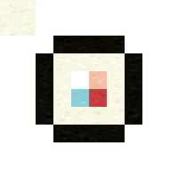
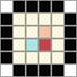
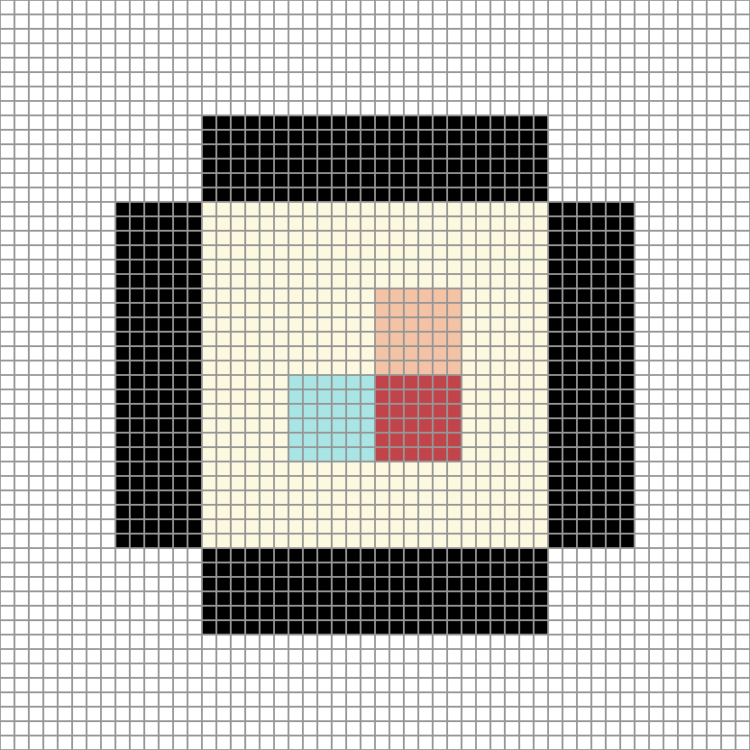

# restore-bead-pattern

一个用于 **Codex** 的开源 Skill，也可以作为本地命令行工具使用。它从已经具有离散方格结构的拼豆、十字绣、簇绒、刺绣或像素作品照片中恢复原生逻辑网格，导出可复核的 PNG、CSV 与 JSON 图纸。

> This project restores a grid that already exists in the source. It is not a general photo-to-pixel-art converter.

当前算法版本：`0.4.1`；输出 Schema：`1.2`。

> **macOS 版本说明**：当前公开发行版以 macOS 本地流程为主要使用环境；核心 Python CLI 同时通过 Ubuntu 上的 Python 3.10–3.12 与 macOS 14 / Python 3.12 CI。Windows 尚未验证。

## macOS 版本示例

<table>
  <tr>
    <td width="33.33%" align="center"></td>
    <td width="33.33%" align="center"></td>
    <td width="33.33%" align="center"></td>
  </tr>
  <tr>
    <td align="center">合成绒线纹理输入</td>
    <td align="center">原生网格复原</td>
    <td align="center">6×整数复制 · 52×52模具</td>
  </tr>
</table>

> 三张图均由项目的确定性合成 fixture 和公开 Skill 在 macOS 本地生成，不含第三方参考图。它们展示的是“已有离散网格复原”和明确授权后的整数放大流程。

## 欢迎志愿者 / Contributors welcome

不会编程也可以参与。当前特别需要：

- Apple Silicon 与 Intel Mac 的干净安装测试；
- 中英文文档、无障碍说明和教程；
- 本人拥有版权或明确开放许可的拼豆、十字绣、簇绒测试样本；
- 实体52×52 / 78×78模具测量和色卡差异记录；
- Python/CV 网格识别、旋转/透视处理及确定性回归测试。

从 [`good first issue`](https://github.com/Rabbitgenius-rgb/restore-bead-pattern/labels/good%20first%20issue) 或 [`help wanted`](https://github.com/Rabbitgenius-rgb/restore-bead-pattern/labels/help%20wanted) 领取一个小任务。开始前请阅读 [`CONTRIBUTING.md`](CONTRIBUTING.md)，使用问题与想法请发到 [Discussions](https://github.com/Rabbitgenius-rgb/restore-bead-pattern/discussions)。安全问题请按 [`SECURITY.md`](SECURITY.md) 私下报告。

提交样本时不要上传未授权角色图、付费图纸、商家完整色卡或含私人信息的截图。合并后的贡献会出现在 GitHub Contributors；重要贡献也会在 Release Notes 中致谢。

## 功能

- 自动估计原生方格的格距、相位和内容尺寸。
- 区分外部浅色背景与黑色轮廓包围的浅色主体。
- 输出候选网格、源图叠加、置信度与待复核格子。
- 可选映射至内置的 MARD 221 compatible 屏幕参考色号。
- 将恢复后的内容按 1 格对 1 孔放入 52×52 或 78×78 温州式模具预设。
- 对已恢复图纸进行 2–8 倍整数格复制，不从照片纹理中虚构新细节。
- 支持 `restore`、`scale`、`revise`、`render` 四个命令。

## 不适用范围

不要用它把普通人物照片、插画或风景重新设计成像素画。输入必须已经包含可恢复的规则方格，例如清晰拼豆、针脚块、织物格或阶梯状像素边缘。旋转、明显透视、严重遮挡、多主体及缺乏重复格距证据的图片可能返回 `review` 或 `fail`。

## 安装

需要 Python 3.10–3.12、NumPy 和 Pillow。

```bash
git clone https://github.com/Rabbitgenius-rgb/restore-bead-pattern.git
cd restore-bead-pattern
python3 -m pip install -r requirements.txt
mkdir -p ~/.codex/skills
cp -R skills/restore-bead-pattern ~/.codex/skills/
```

也可以不安装 Skill，直接调用仓库中的脚本。

## 快速开始

恢复普通离散作品的原生网格：

```bash
python3 skills/restore-bead-pattern/scripts/restore_pattern.py restore input.png \
  --out output-pattern
```

恢复拼豆作品、匹配 MARD 221 compatible 色号，并选择温州式模具：

```bash
python3 skills/restore-bead-pattern/scripts/restore_pattern.py restore input.png \
  --out output-pattern \
  --palette mard-221-compatible \
  --board-size auto
```

在用户明确要求主体同步放大后，将已恢复逻辑格精确复制两倍并放入 78×78 模具：

```bash
python3 skills/restore-bead-pattern/scripts/restore_pattern.py scale \
  output-pattern/pattern.json \
  --factor 2 \
  --board-size 78x78 \
  --out output-pattern-2x
```

完整参数与 `revise`、`render` 契约见
[`skills/restore-bead-pattern/references/contracts.md`](skills/restore-bead-pattern/references/contracts.md)。

## 输出与状态

主要文件包括：

- `source_grid_overlay.png`：原生网格与源图的对齐证据；
- `candidates.png` / `candidates.json`：竞争网格候选；
- `pattern_preview.png` / `pattern_grid.png`：原生图纸；
- `pattern_review.png` / `review.csv`：低置信格；
- `matrix.csv` / `pattern.json`：逐格矩阵与完整机器可读清单；
- `board_preview.png` / `board_grid.png` / `board.csv`：可选模具图纸。

状态含义：

- `pass`：自动证据达到门槛，仍应人工检查叠加图；
- `review`：存在待确认网格、颜色、格子或模具建议；
- `fail`：不得把候选当作完成图纸。

非 `--strict` 模式可能在 `review` 或 `fail` 时仍以退出码 0 保存诊断文件，请始终读取 stdout 的单行 JSON 摘要。

## 安全与隐私

- 处理完全在本地进行，生产脚本不联网。
- `pattern.json` 仅记录源文件 SHA-256 与尺寸，不记录绝对路径。
- `source_grid_overlay.png`、`candidates.png` 和 `board_source_overlay.png` 含有源图像素，可能仍属于敏感或受版权保护内容；不要默认提交到公开仓库。
- 错误日志可能显示调用者提供的本地路径。
- `--overwrite` 仅允许替换由本工具创建并带有安全标记的输出目录；对主目录、当前目录、Skill 目录、符号链接或输入文件祖先目录会拒绝执行。
- 使用者应确保拥有处理和分享输入、输出的权利。

## MARD-compatible 色表说明

内置色表是可选的 221-code **屏幕 RGB 兼容参考**，不是官方或经过校准的实体豆标准。不同品牌、批次、表面效果、灯光和显示器都会产生色差；购买前必须用目标商家的实体色卡复核。

code/HEX 数据依据 Jett-Wu/Perler_Beads_Generator 固定提交中的 MIT 数据进行再分发，完整归因见 [`THIRD_PARTY_NOTICES.md`](THIRD_PARTY_NOTICES.md)。Pindou 与 Bitbead 仅用于独立核对，不被表述为授权方。

本项目与 MARD 或任何零售商无隶属、赞助或背书关系；名称仅用于兼容性描述，相关商标属于各自权利人。

## 温州式模具预设

52×52 与 78×78 是本工具支持的几何预设。模具选择与色卡选择相互独立。无直接板体证据时，`auto` 只能给出最小可容纳建议，并保持 `review`，不会假装已经识别出实体模具。

## 验证

```bash
PYTHONDONTWRITEBYTECODE=1 python3 \
  skills/restore-bead-pattern/scripts/self_test.py
python3 tests/validate_release.py
```

自测使用运行时生成的合成纹理图，不包含用户照片或私有 fixture。PNG 的逐字节结果可能随 Pillow 版本变化，因此 CI 主要验证结构、计数、拓扑与契约。

## 许可证

项目代码和项目生成的合成文档素材采用 [MIT License](LICENSE)。第三方数据的许可证与归因见 [THIRD_PARTY_NOTICES.md](THIRD_PARTY_NOTICES.md)，展示素材来源与哈希见 [ASSET_ATTRIBUTIONS.md](ASSET_ATTRIBUTIONS.md)。
